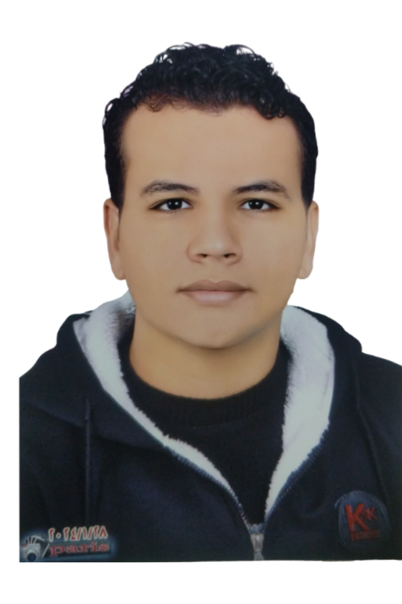

# Mohamed Tayal – Data Mining Portfolio

A modern, responsive portfolio website showcasing data mining projects, skills, and certifications. Built with HTML, CSS, and JavaScript featuring a premium UI/UX design with light/dark mode support.



## ✨ Features

- **Responsive Design** - Fully responsive across all devices (mobile, tablet, desktop)
- **Dark/Light Mode** - Smooth theme switching with persistent preference
- **Modern UI/UX** - Glassmorphism effects, smooth animations, and gradient accents
- **Interactive Elements** - Animated cards, hover effects, and scroll animations
- **Project Showcase** - Filterable project gallery with detailed modal views
- **Certificate Gallery** - PDF viewer for certificates with download option
- **Resume Page** - Professional CV-style resume with skill bars and timeline
- **Contact Section** - FAQ accordion and social links
- **GSAP Animations** - Smooth scroll-triggered animations

## 🛠️ Technologies Used

- **HTML5** - Semantic markup
- **CSS3** - Custom properties, Flexbox, Grid, animations
- **JavaScript** - Vanilla JS for interactivity
- **GSAP** - ScrollTrigger for scroll animations
- **Google Fonts** - Inter font family

## 📁 Project Structure

```
portfolio/
├── index.html              # Main homepage
├── .nojekyll               # Disable Jekyll processing
├── .gitignore              # Git ignore rules
├── README.md               # Project documentation
│
├── assets/
│   ├── css/
│   │   ├── style.css       # Main stylesheet
│   │   └── resume.css      # Resume page styles
│   │
│   ├── js/
│   │   ├── main.js         # Main JavaScript
│   │   ├── theme.js        # Theme toggle logic
│   │   ├── projects.js     # Projects data & rendering
│   │   ├── animations.js   # GSAP animations
│   │   └── resume.js       # Resume page scripts
│   │
│   ├── images/
│   │   └── profile.png     # Profile photo
│   │
│   └── resume.html         # Resume/CV page
│
└── *.pdf                   # Certificate files
```


## 🚀 Quick Start

### Run Locally

1. **Clone the repository**
   ```bash
   git clone https://github.com/YOUR_USERNAME/portfolio.git
   cd portfolio
   ```

2. **Open in browser**
   - Simply open `index.html` in your browser
   - Or use a local server:
   ```bash
   # Using Python
   python -m http.server 8000
   
   # Using Node.js (npx)
   npx serve
   ```

3. **View the site**
   - Open `http://localhost:8000` in your browser

### Deploy on GitHub Pages

1. Push your code to GitHub
2. Go to your repository **Settings**
3. Navigate to **Pages** (in the sidebar)
4. Under **Source**, select:
   - Branch: `main`
   - Folder: `/ (root)`
5. Click **Save**
6. Your site will be live at: `https://YOUR_USERNAME.github.io/portfolio/`

## 🎨 Customization

### Change Colors
Edit the CSS variables in `assets/css/style.css`:
```css
:root {
    --color-primary: #5B4FE9;
    --color-accent: #00C9C9;
    /* ... other variables */
}
```

### Update Content
- **Projects**: Edit `assets/js/projects.js`
- **Personal Info**: Edit `index.html` and `assets/resume.html`
- **Certificates**: Add PDFs to root folder and update `projects.js`

## 📱 Browser Support

- Chrome (latest)
- Firefox (latest)
- Safari (latest)
- Edge (latest)

## 📄 License

This project is open source and available under the [MIT License](LICENSE).

## 🔗 Live Demo

🌐 **[View Live Portfolio](https://YOUR_USERNAME.github.io/portfolio/)**

---

Made with ❤️ by Mohamed Tayal | Delta University for Science & Technology
